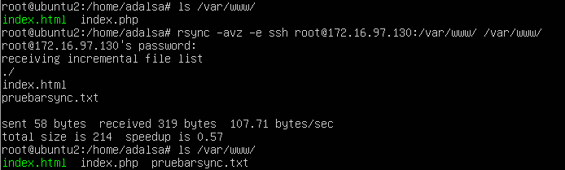
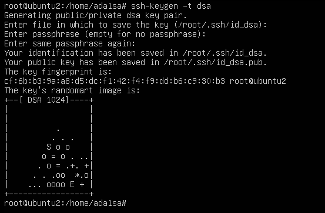
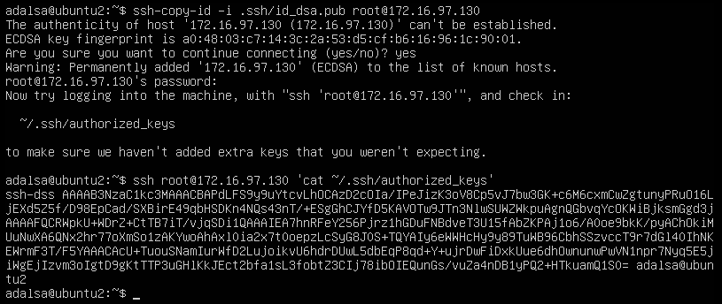
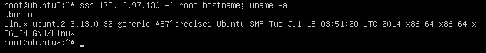
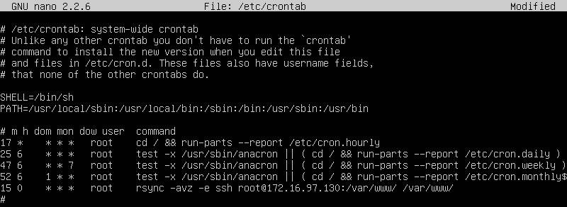
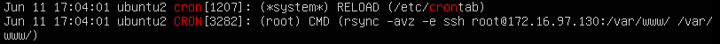

Práctica 2. Clonar la información de un sitio web
=================================================
Índice
------
* [Objetivos](#objetivos)
* [Entorno](#entorno)
* [Crear un tar con ficheros locales en un equipo remoto](#crear-un-tar-con-ficheros-locales-en-un-equipo-remoto)
* [Instalar la herramienta rsync](#instalar-la-herramienta-rsync)
* [Acceso sin contraseña para ssh](#acceso-sin-contraseña-para-ssh)
* [Programar tareas con crontab](#programar-tareas-con-crontab)

-----------------------------------------------------------
Objetivos
---------
En esta práctica se pretende probar distintos métodos para clonar la información de un sitio web entre los servidores y finalmente automatizar esta tarea mediante el uso de la herramienta ++cron++.

Entorno
-------

Se ha utilizado el monitor de máquina virtual VMware Workstation 11 para crear las máquinas utilizadas para la práctica:

**Backend1 - Servidor LAMP**  
Hostname: ubuntu1  
OS: Ubuntu 12.04.5  
IP: 172.16.97.130  

**Backend2 - Servidor LAMP**  
Hostname: ubuntu2  
OS: Ubuntu 12.04.5  
IP: 172.16.97.129  

Crear un tar con ficheros locales en un equipo remoto
-----------------------------------------------------
La primera aproximación como solución al problema sería enviar la información en un archivo tar comprimirdo con gzip y enviarlo por ssh.
Para evitar tener que almacenar el fichero tar en el equipo origen redireccionamos la salida del programa tar hacia el comando ssh.

    tar czf - directorio | ssh equipodestino 'cat > ~/tar.tgz'

Este método puede ser útil en un momento dado pero noes adecuado para sincronizar grandes cantidades de información. Para este caso la mejor herramienta es rsync

Instalar la herramienta rsync
-----------------------------
Para instalar la herramienta rsync utilizaremos el gestor de paquetes apt:

    #apt-get install rsync

Para probar su funcionamiento clonaremos el contenido de la carpeta del servidor web de la máquina principal a la máquina secundaria, para ello ejecutamos el siguiente comando desde la máquina secundaria:

    rsync -avz -e ssh root@maquina1:/var/www/ /var/www/

Las opciones indicadas son:

* **-a**: Los ficheros son transmitidos en modo "archive", esto quiere decir que los enlaces simólicos, dispositivos, atributos, permisos, propietarios, etc. seran preservados en la transferencia.

* **-v**: Modo verbose.

* **-z**: Se usara compresión para la transferencia.

* **-e**: Especifica la shell remota a usar.





Rsync también permite especificar que directorios se excluirán en la copia:
```
    rsync -avz --delete --exclude=**/stats --exclude=**/error --exclude=**/files/pictures -e "ssh -l root" root@maquina1:/var/www/ /var/www/
```
Con este comando estaremos haciendo la copia completa del directorio /var/www pero excluyendo /var/www/error , /var/www/stats y /var/www/files/pictures.

La opción **--delete** indica que aquellos ficheros que se encuentren en la carpeta destino pero no en la origen serán eliminados

Acceso sin contraseña para ssh
------------------------------
Como primer paso para automatizar la tarea de clonado mediante la herramienta ssh debemos hacer que la tarea de clondo no requiera de la intervención de administrador para teclear la contraseña necesaria apra realizar la transferencia.

Para poder ejecutar comandos en equipos remotos mediante ssh sin contraseña utilizaremos autenticación basada en un par de claves pública-privada.

Para generar las key usaremos la herramienta **ssh-keygen**, así en la máquina secundaria ejecutamos:

    ssh-keygen -t dsa

Con la opción **-t dsa** indicamos que el tipo de clave a crear sea dsa.

Dado que que pretendemos conectar los equipos sin contraseña debemos dejar en blanco cuando nos pide **passphrase**.



Generará, por defecto, el fichero ~/.ssh/id_dsa para la clave privada y el fichero ~/.ssh/id_dsa.pub para la clave pública. Este formato es válido para el protocolo 2 de SSH

Una vez obtenida las claves debemos copiar la clave pública al equipo remoto, añadiéndola al fichero ~/.ssh/authorized_keys, que deberá tener permisos 600, para ello utilizaremos la herramienta **ssh-copy-id**.

    ssh-copy-id -i .ssh/id_dsa.pub root@maquina1



Probamos que ahora es posible conectar por ssh sin contraseña.



Programar tareas con crontab
----------------------------
Ahora que podemos acceder sin necesidad de introducir la contraseña podemos programar la clonación con la herramienta **cron**, es un administrador regular de procesos en segundo plano (demonio) que ejecuta procesos o guiones a intervalos regulares (por ejemplo, cada minuto, día, semana o mes). Los procesos que deben ejecutarse y la hora en la que deben hacerlo se especifican en el fichero crontab.

Los 7 campos que forman las lineas del fichero crontab están organizados de la siguiente manera:

**Minuto Hora    DiaDelMes   Mes DiaDeLaSemana   Usuario Comando**
* **Minuto**: indica el minuto de la hora en que el comando será ejecutado, este valor debe de estar entre 0 y 59.  
* **Hora**: indica la hora en que el comando será ejecutado, se especifica en un formato de 24 horas, los valores deben estar entre 0 y 23, 0 es medianoche.  
* **DíaDelMes**: indica el día del mes en que se quiere ejecutar el comando. Por ejemplo se indicaría 20, para ejecutar el comando el día 20 de cada mes.  
* **Mes**: indica el mes en que el comando se ejecutará (1-12).  
* **DiaDeLaSemana**: indica el día de la semana en que se ejecutará el comando (1=lunes y hasta 7=domingo).  
* **Usuario**: indica el usuario que ejecuta el comando.  
* **Comando**: indica el comando que se desea ejecutar. Este campo puede contener múltiples palabras y espacios.  

Un asterisco \* como valor en los primeros cinco campos indicará el valor "todo". Así, un \* en el campo de minuto indicará todos los minutos de la hora.

Configuraremos cron para que ejecute el clonado como usaurio root todas las noches a las 00:15.



Para comprobar que cron esta funcionando podemos consutar el registro del sistema **/var/log/syslog**.

    cat /var/log/syslog|grep -i cron



<br>
>Adrián Ávarez Sáez
