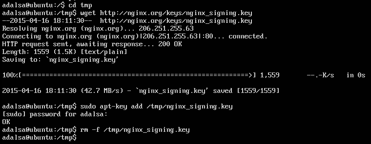
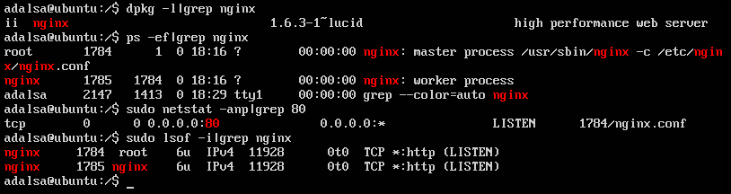
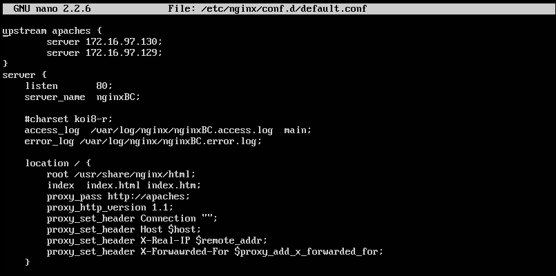
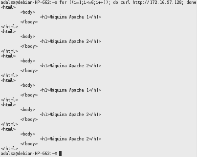
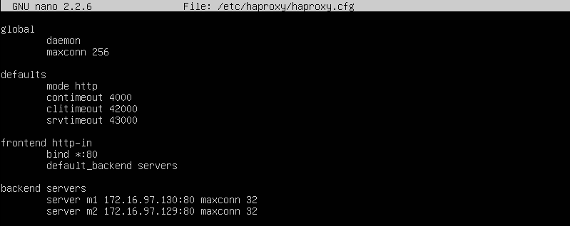
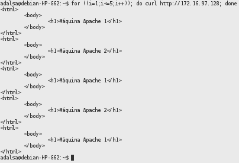

**Práctica 3. Balanceo de carga**
=================================
Índice
------
* [Objetivos](#objetivos)
* [Entorno](#entorno)
* [Servidor web nginx](#servidor-web-nginx)
* [Balanceo de carga con HAProxy](#balanceo-de-carga-con-haproxy)
* [Bibliografía](#bibliografía)
  

-----------------------------------------------------------
  
    
Objetivos
---------
En esta práctica se configurara una red entre varias máquinas configurando un balanceador de carga que reparta la carga del tráfico http entre varios servidores finales Apache.

De esta forma se conseguirá una infraestructura redundante y de alta disponibilidad.

Entorno
-------

Se ha utilizado el monitor de máquina virtual VMware Workstation 11 para crear las máquinas utilizadas para la práctica:

**Balanceador nginx/HAProxy**  
Hostname: ubuntu  
OS: Ubuntu 12.04.5  
IP: 172.16.97.128

**Backend1 - Servidor LAMP**  
Hostname: ubuntu1  
OS: Ubuntu 12.04.5  
IP: 172.16.97.130  

**Backend2 - Servidor LAMP**  
Hostname: ubuntu2  
OS: Ubuntu 12.04.5  
IP: 172.16.97.129  

Servidor web nginx
-------------------
###Instalar nginx en Ubuntu Server 12.04###
Realizaremos la instalación utilizando el sistema gestor de paquetes apt.
En primer lugar importaremos la clave del repositorio de software.

Añadimos los repositorios al archivo **/etc/apt/source.list**.

Actualizamos el indice de paquetes e instalamos el paquete **nginx**.

    sudo apt-get update
    sudo apt-get install nginx

 Comprobamos que el paquete se ha instalado e iniciado correctamente.

 

 

###Balanceo de carga usando nginx###

Para configurar nginx debemos modificar el fichero **/etc/nginx/conf.d/default.conf**

Para definir el grupo de servidores finales a los que se les redirigira el tráfico utilizaremos la directiva **upstream**.

    upstream apaches {
        172.16.97.130;
        172.16.97.130;
    }

Esta directiva debe ubicarse al principio del fichero de configuración y sin anidar en ningún otro contexto.

Los servidores contenidos en el grupo pueden escuchar en diferentes puertos.

Por defecto las peticiones son distribuidas entre los servidores usando el método de balanceo round-robin ponderado, pudiendo especificar el peso de cada servidor mediante el parámetro **weight**, su valor por defecto es 1.

Para el resto de configuraciones deberemos actuar dentro del contexto **server** que nos permite establecer una configuración para un servidor virtual, en primer lugar definiremos el nombre de este servidor y el puerto por el que escuchará mediante las siguientes directivas.

    listen 80;
    server_name nginxBC;

En este contexto también podemos definir las rutas, formatos y demás opciones de los registros de acceso y errores mediante las siguientes directivas **acces_log** y **error_log**.

El resto de configuraciones se realizarán en el contexto **location** que nos permite establecer una configuración en función del URI de una solicitud. En nuestro caso será la misma configuración para cualquier perición así que lo definimos así:

    location / {}

A continuación configuraremos a nginx para indicarle que use el grupo **apaches** para pasarle las peticiones, para ello usaremos la directiva **proxy_pass** que nos permite establecer el protocolo y la dirección a la que se le pasaran las peticiones.

    proxy_pass http://apaches

Tambíen debemos indicar que versión del protocolo HTTP se usará mediante la directiva **proxy_http_version** usaremos la versión 1.1 que es la recomendada para conexiones keepalive.

    proxy_http_version 1.1;

Se realizaran algunas modificaciones en las cabeceras de las peticiones antes de reenviarlas, para ello se usa la directiva **proxy_set_header**.

Limpiamos el campo **Connection** de la cabecera ya que esta no debe ser comunicada por los proxies en conexiones adicionales y es necasrio para las conexiones keepalive.

    proxy_set_header Connection "";

En caso de que el campo **Host** no este presente en la cabecera de la petición del cliente este se fijara con la variable **$host** cuyo valor es el nombre del servidor primario.

    proxy_set_header Host $host;

Se actuará igual para los campos **X-Real-IP** y **X-Forwarded-For** que identifican la dirección IP de origen de un cliente cuando este conecta a un servidor a través de un proxy o balanceador de carga.

    proxy_set_header X-Real-IP $remote_addr;
    proxy_set_header X-Forwarded-For $proxy_add_x_forwarded_for;

La variable **$proxy_add_x_forwarded_for** contiene el valor del campo **X-Forwarded-For** de la cabecera de la petición del cliente anexándole el valor de la variable **$remote_addr** separado por una coma.

Después de aplicar todas estas directivas el fichero de configuración queda así:

Para aplicar los cambios recargamos el fichero de configuración mediante el comando:

    nginx -s reload

Para comprobar que la configuración funciona correctamente usaremos la herramienta cURL.

Como se puede apreciar en la imagen nginx va alternando el servidor al que reenvía la respuesta en cada petición.

Si se quiere asignar más carga a un servidor que a otro, por ejemplo por que uno de ellos fuera mas potente podemos utilizar el parámetro **weight** en el contexto de **upstream**, este parámetro por defecto tiene el valor 1 cuanto mayor sea su valor más peticiones se le asignaran.

Como ejemplo le aumentaremos en una unidad el valor para el servidor 2.

    upstream apaches {
        server 172.16.97.130;
        server 172.16.97.129 weight=2;
    }

De esta forma dos de cada tres peticiones recibidas se reenviarán al segundo servidor. Lo podemos comprobar usando de nuevo la herramienta cURL.

Para hacer un balanceo por IP, de modo que todo el tráfico que provenga de una misma dirreción IP sea recibido durante toda la sesión por el mismo servidor final excepto que este se encuentre en un estado de no disponibilidad o marcado con la directiva **down** en el contexto de upstream, se puede usar la directiva **ip_hash**, esta directiva se utiliza en el contexto de upstream. Usa los 3 primeros octetos de la dirreción IPv4 o la dirección completa en IPv6 como clave hash. Esta directiva es compatible con el parametro **weidth**.

    upstream apaches {
        ip_hash;
        server 172.16.97.130;
        server 172.16.97.129;
    }

De nuevo lo comprobamos con cURL.

La función hash de nginx no ofrece consistencia, por tanto si el número de servidores varía por ejemplo por tareas de mantenimiento en un servidor todos los clientes conectados actualmente podrían ser reasignados, aunque nginx ofrece un soporte limitado para intentar preservar los valores hash añadiendo el parámetro **down** al servidor que va a pasar a no disponible en **upstream**. Existen módulos de nginx desarrollados por terceros para solventar este problema añadiendo una función hash consistente.

Nginx permite conexiones keepalive desde los clientes(front-end keepalive connections) y hacia los servidores(upstream keepalive connections) de forma independiente.

Las conexiones keepalive hacia los servidores de upstream que se encuentran ociosas se mantienen en una cache de conexiones keepalive y cuando nginx necesita reenviar una solicitud a un upstream usa una de las conexiones de la cache en vez de crear una nueva conexión TCP.

Para activar las upstream keepalive connections y especificar cuantas conexiones inactivas puede guardar la cache, dentro del contexto **upstream** debemos añadir la directiva **keepalive** seguida del número máximo de conexiones keepalive.

    upstream apaches {
        server 172.16.168.130;
        server 172.16.168.131;
        keepalive 3;
    }

###Opciones de configuración del nginx para establecer cómo le pasará trabajo a las máquinas servidoras finales###

Aparte de las opciones vistas anteriormente existen otros parámetros que pueden acompañar a la definición de un servidor dentro del contexto de upstream, por ejemplo las siguientes sirven para gestionar posibles errores o caídas de los servidores:

**max_fails = number**  
Establece el número de intentos fallidos para comunicarse con el servidor en el tiempo establecido por fail_timeout para considerar que el servidor no estará disponible durante un tiempo también fijado por fail_timeout, por defecto su valor es 1, el valor 0 lo desactiva.

**fail_timeout = time**  
Establece el tiempo en el que deben ocurrir max_fails intentos fallidos de conexión con el servidor para considerarlo no disponible, también establece el tiempo por el que el servidor se considerara no disponible. El valor por defecto es 10 segundos.

**backup**  
Marca el servidor como backup server. Solo se le pasaran peticiones cuando los servidores primarios no estén disponibles

Ejemplo:

    upstream backend{
        ip_hash;
        server 172.16.97.130 max_fails=2 fail_timeout=20s;
        server 172.16.97.129 weight=2;
    }

Balanceo de carga con HAProxy
-----------------------------
###Instalar HAProxy###
Utilizaremos el gestor de paquetes apt para la instalación.

    sudo apt-get install haproxy

Si deseamos que HAProxy sea iniciado por init debemos modificar el archivo **/etc/default/haproxy** y establecer el parámetro **ENABLED** a 1.
###Configuración básica de HAProxy como balanceador###
Para configurar HAProxy debemos modificar el fichero **/etc/haproxy/haproxy.cfg**.

En primer lugar configuramos los parámetros de las sección **global**.

La primera directiva que implementaremos sera **daemon** que hace el proceso se ejecute como un daemon.  
Para asegurar un mínimo rendimiento estableceremos un mínimo número máximo de conexiones simultaneas mediante las siguiente directiva:

    maxconn 256

A continuación definiremos las directivas pertenecientes a la secciones proxies, estas pueden tomar varias formas: defaults, listen, frontend and backend.

Empezamos con la sección **defaults** esta sección establece parámetros por defecto para el resto de secciones declaradas después de esta. En un archivo de configuración puede haber varias secciones **default** que reinician los parámetros establecidos por sus anteriores.

Utilizando la directiva **mode** fijaremos el tipo de proxy para tráfico http.

    mode http

La directiva **contimeout** permite fijar el tiempo máximo de espera para un intento de conexión a un servidor. El tiempo se especifica en milisegundos por defecto aunque tanto para esta directiva como para cualquier otra que tengo como parámetro un tiempo HAProxy permite varios formatos de tiempo: us, ms, s, m, h y d. Esta directiva se sigue proporcionando por retrocompatibilidad pero actualmente esta obsoleta y se recomienda usar **timeout connect** que tiene los mismos parámetros.

    contimeout 4000

Con la directiva **clitimeout** permite ajustar el tiempo máximo de inactividad en el lado del cliente al igual que la directiva anterior esta en desuso a favor de la directiva **timeout client**.

    clitimeout 42000

La última directiva que estableceremos en esta sección será **srvtimeout** que permite fijar el tiempo máximo de inactividad en el lado del servidor, también esta obsoleta en su lugar se recomienda usar **timeout server**.

    srvtimeout 43000

La siguiente sección que configuramos será **frontend http-in**, las secciones frontend describe un conjunto de sockets a la escucha de conexiones de clientes.

Para definir el puerto de escucha para este puerto se debe usar la directiva **bind \<address\>:port_range**.  
    bind \*:80

Para especificar los servidores del backend a los que les reenviaremos las peticiones usamos la directiva **default_backend**

    default_backend servers

Por último definiremos la sección **backend** que nos permite especificar un conjunto de servidores a los que el proxy se conectara para reenviar las conexiones entrantes.

Para declarar un servidor en el backend se usa la directiva **server \<name\> \<address\>:port param**.

    server m1 172.16.97.130:80 maxconn 32
    server m2 172.16.97.129:80 maxconn 32

EL archivo de configuración queda de la siguiente forma:

Para iniciar HAProxy ejecutamos el siguiente comando:

    service haproxy start

en caso de que no se haya agregado a init usamos el siguiente comando para iniciar HAProxy:

    sudo /usr/sbin/haproxy -f /etc/haproxy/haproxy.cfg

Para probar que la configuración se ha aplicado correctamente utilizamos la herramienta cURL.

Las peticiones se reparten de forma igual entre ambos servidores ya que por defecto HAProxy reparte las peticiones con el algoritmo roundrobin.

Bibliografía
------------
* [Página Oficial nginx](http://wiki.nginx.org/NginxEs)
* [Documentación nginx](http://nginx.org/en/docs/)
* [Using nginx as HTTP load balancer](http://nginx.org/en/docs/http/load_balancing.html)
* [Load Balancing with NGINX and NGINX Plus, Part 1](http://nginx.com/blog/load-balancing-with-nginx-plus/)
* [Load Balancing with NGINX and NGINX Plus, Part 2](http://nginx.com/blog/load-balancing-with-nginx-plus-part2/)
* [RFC2616 - Hypertext Transfer Protocol -- HTTP/1.1](http://www.ietf.org/rfc/rfc2616.txt)
* [Forwarding Visitor’s Real-IP + Nginx ](https://rtcamp.com/tutorials/nginx/forwarding-visitors-real-ip/)
* [Consistent of ip_hash](http://www.serverphorums.com/read.php?5,540693)
* [HTTP Keepalive Connections and Web Performance](http://nginx.com/blog/http-keepalives-and-web-performance/)
* [HAProxy Configuration Manual](http://cbonte.github.io/haproxy-dconv/configuration-1.4.html)

  
>Adrián Álvarez Sáez
