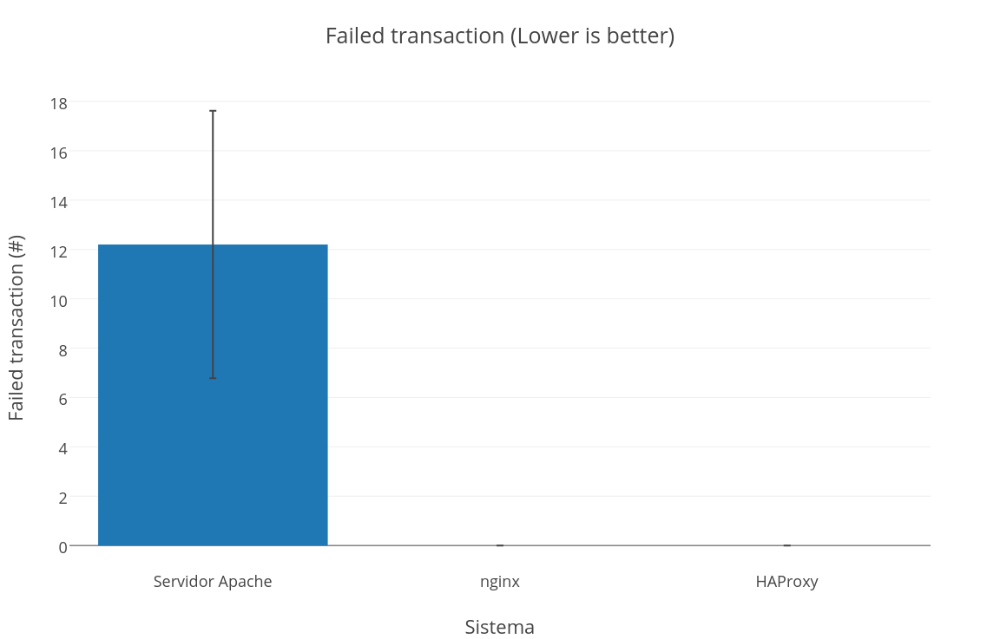
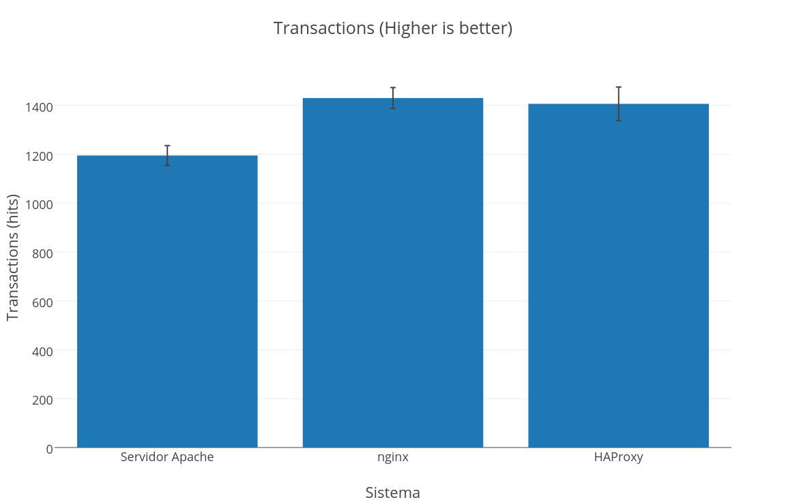
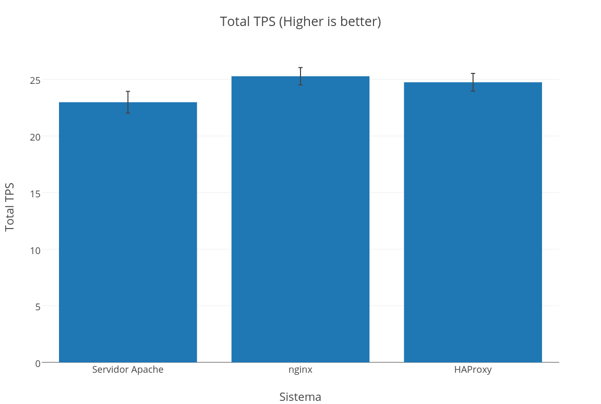
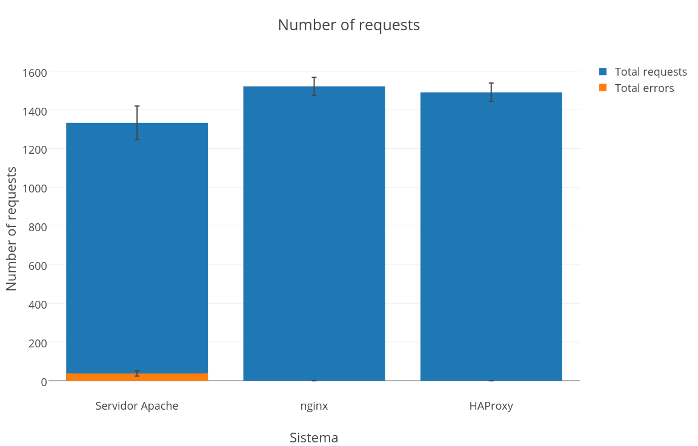

**Práctica 4. Comprobar el rendimiento de servidores web**
======================================================

Indice
------
* [Objetivos](#objetivos)
* [Entorno](#entorno)
* [ApacheBench](#apachebench)
* [Siege](#siege)
* [OpenWebLoad](#openwebload)

-------------------------------------------------------------------------------

Objetivos
---------
En esta prática mediremos el rendimiento de nuestros servidores web usando herramientas que nos permitan simular un número determinado de clientes realizando peticiones contra el servidor creando una carga HTTP específica y así observar el comportamiento de los servidores bajo una gran demanda. Para este propósito usaremos las siguientes herramientas de benchmark:

* ApacheBench
* Siege
* OpenWebLoad

Realizaremos una batería de pruebas con las herramientas citadas para probar el rendimiento de tres configuraciones diferentes de servidores web:

* Servidor LAMP solo
* Granja web con nginx
* Granja web con HAProxy

Para comparar los resultados de cada configuración, se realizaran 10 mediciones en cada una de las configuraciones con cada una de las herramientas, y una vez obtenidos los resultados se calculara la media aritmética y desviación típica, estos resultados se presentarán en una tabla y en gráficas.


Entorno
-------

Se ha utilizado el monitor de máquina virtual VMware Workstation 11 para crear las máquinas utilizadas para la práctica:

**Balanceador nginx/HAProxy**  
Hostname: ubuntu
OS: Ubuntu 12.04.5  
IP: 172.16.97.128

**Backend1 - Servidor LAMP**  
Hostname: ubuntu1  
OS: Ubuntu 12.04.5  
IP: 172.16.97.130  

**Backend2 - Servidor LAMP**  
Hostname: ubuntu2  
OS: Ubuntu 12.04.5  
IP: 172.16.97.129  
**Cliente**  
Hostname: ubuntu2  
OS: Ubuntu 12.04.5  
IP: 172.16.97.131  

Todas las máquinas emulan un procesador de doble núcleo y utilizan 512MB de RAM cada una.

El script PHP que ejecutaran los servidores del backend en respuesta a las peticiones será el siguiente:

```php
<?php

$tiempo_inicio = microtime( true );

for( $i=0; $i<300000; $i++ ) {
    $a = $i * $i;
    $b = $a - $i;
    $c = $a / $b;
    $d = 1 / $c;
}

$tiempo_fin = microtime( true );

echo "Teimpo empleado; " . round( $tiempo_fin - $tiempo_inicio , 4 );

?>
```

ApacheBench
-----------
Para probar el rendimiento del sistema con la herramienta ApacheBench necesitamos tener instalado el paquete **apache2-utils**, los instalamos usando el gestor de paquetes **apt**:

    apt-get install apache2-utils

Lanzaremos la herramienta **ab**:

    ab -n1000 -c100 172.16.97.130/index.php

* **-n1000**: Se realizaran 1000 peticiones.
* **-c100**: Las peticiones se realizarán concurrentemente de 100 en 100.

En la siguietne tabla se pueden observar los resultados más significativos.

| Time taken for test (seconds) | Failed request | Request per second | Time per request (ms)
:--------------: | :------------: | :---------------: | :---------------: | :---------------:
**Servidor Apache**| 45.8414 ± 1.9839 | 97.3 ± 4.2907 | 21.854 ± 0.9219 | 45.8474 ± 1.9782
**Granja con nginx** | 38.2268 ± 2.1181 | 99.8 ± 6.1935 | 26.0390 ± 1.3866 | 38.1268 ± 2.2220
**Granja con HAProxy** | 35.7056 ± 1.4347 | 103.1 ± 13.8380 | 28.0490 + 1.0746 | 35.7056 ± 1.4347

Los resultados mostrados en la tabla se pueden encontrar en formato CSV en [Datos/AB](Datos/AB).

En las siguientes gráficas podemos observar gráficamente los resultados mostrados en la tabla anterior.

")  

")

")

")

En estas gráficas se puede apreciar que HAProxy a mostrado mejores resultados en las pruebas realizadas.

Siege
-----
La siguiente herramienta de benchmark que utilizaremos para medir el rendimiento es **Siege**, para instalarla:

    apt-get install siege

Esta vez ejecutaremos el test con mayor concurrencia:

    siege -b -v -c300 -t60s 172.16.97.130/index.php

* **-b**: Ejecuta el test sin retraso entre peticiones.
* **-v**: Modo verbose.
* **-c300**: Las peticiones se realizarán concurrentemente de 300 en 300.
* **-t60s**: Indicamos que el test se ejecute durante 60 segundos.

La siguiente tabla muestra los resultados más relevantes:

| Availability(%) | Failed transaction| Response time (seconds) | Transaction per second (seconds) | Transactions
:--------------: | :------------: | :---------------: | :---------------: | :---------------:
**Servidor Apache**| 98.986 ± 0.4628 | 12.2 ± 5.4185 | 12.639 ± 0.4103 | 20.114 ± 0.6721 | 1195.1 ± 40.4857
**Granja con nginx** | 100 | 0 | 11.259 ± 0.3802 | 24.0010 ± 0.7660 | 1430.4 ± 42.8840
**Granja con HAProxy** | 100 | 0 | 11.369 ± 0.3629 | 23.602 ± 1.1250 | 1406.6 ± 68.5525

Los resultados mostrados en la tabla se pueden encontrar en formato CSV en [Datos/Siege](Datos/Siege).

Las siguientes gráficas muestran los resultados obtenidos.

")  



")

")



En los resultados de este test nginx a obtenido unos resultados ligeramente superiores a los de HAProxy.

OpenWebLoad
-----------
En último lugar realizaremos un benchmark con la herramienta **Openload**, para instalarla ejecutamos el siguiente comando:

    apt-get install openload

Ejecutamos la herramienta con el siguiente comando:

    openload -l60 172.16.97.130/index.php 300

* **-l60**: Especificamos que el test durara 60 segundos.
* **300**: Las peticiones se realizarán concurrentemente de 300 en 300.

La siguiente tabla expone los resultados obtenidos:

| Total TPS | Avg. response time (seconds) | Max response time (seconds) | Total requests | Total errors
:--------------: | :------------: | :---------------: | :---------------: | :---------------:
**Servidor Apache**| 22.594 ± 0.9587 | 11.5624 ± 0.3188 | 40.8642 ± 6.7500 | 1333.2 ± 86.1844 | 37.1 ± 13.0342
**Granja con nginx** | 25.345 ± 0.7650 | 10.7027 ± 0.3530 | 18.0641 ± 2.0285 | 1521.7 ± 46.1997 | 0
**Granja con HAProxy** | 24.8160 ± 0.7835 | 10.9537 ± 0.3765 | 17.9233 ± 1.8772 | 1490.6 ± 47.5272 | 0

Los resultados mostrados en la tabla se pueden encontrar en formato CSV en [Datos/Webload](Datos/Webload).

Las siguientes gráficas exponen los datos obtenidos.



")

")




<br><br>
>Adrián Álvarez Sáez
