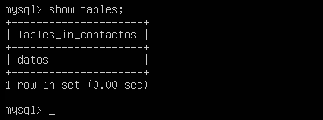
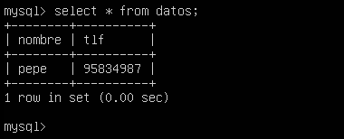
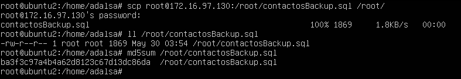
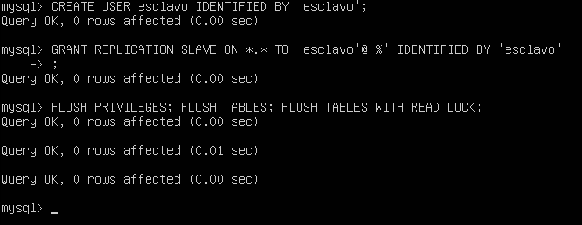
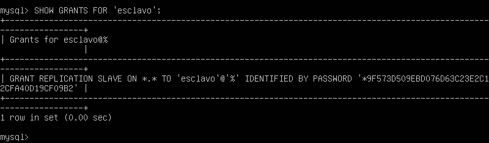
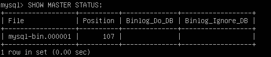
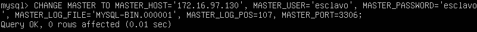
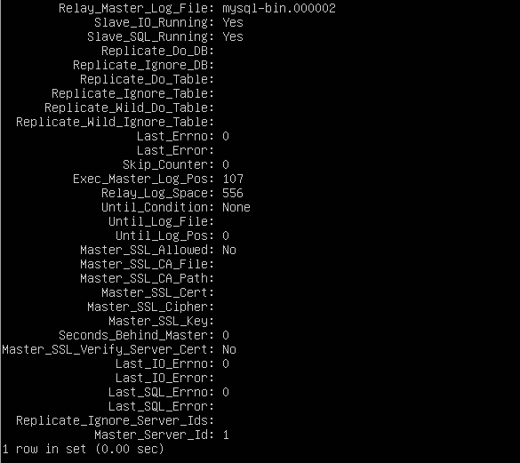
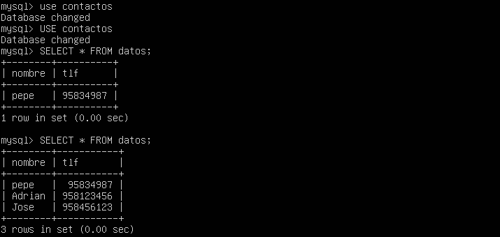

Práctica 5. Replicación de bases de datos MySQL
================================================

Objetivos
---------
En esta práctica se pretende aportar un grado más de fiabilidad a nuestro sistema ante posibles interrupciones de servicio permanentes del servidor maestro, para ello dispondremos de un servidor de backup con MySQL actuando como esclavo de replicación, de esta forma aumentaremos la fiabilidad del sistema sin que se vea afectado el rendimiento del sistema en producción y sin consumir demasiado ancho de banda.

Los objetivos concretos de esta práctica son:  
* Copiar archivos de copia de seguridad mediante ssh.  
* Clonar manualmente BD entre máquinas.  
* Configurar la estructura maestro-esclavo entre dos máquinas para realizar el clonad automático de la información.

Entorno
-------

Se ha utilizado el monitor de máquina virtual VMware Workstation 11 para crear las máquinas utilizadas para la práctica:

**Backend1 - Servidor LAMP**  
Hostname: ubuntu1  
OS: Ubuntu 12.04.5  
IP: 172.16.97.130  

**Backend2 - Servidor LAMP**  
Hostname: ubuntu2  
OS: Ubuntu 12.04.5  
IP: 172.16.97.129  

Crear un tar con ficheros locales y copiarlos en un equipo remoto
-----------------------------------------------------------------
En un primer acercamiento a la solución se podría crear una copia mediante la herramienta tar y transmitirla al servidor de backup mediante ssh.

    tar czf - firectorio | ssh esquipodestino 'cat > ~\tar.tgz'

Como se vio en la práctica 2 esta solución puede parecer útil para una copia de seguridad puntual, pero no es la solución optima para sincronizar grandes cantidades de información de forma de forma periódica.

Crear una BD e insertar datos
-----------------------------
En primer lugar, para probar la solución debemos crear una base de datos en MySQL en el servidor de producción, insertaremos algunos datos, para ellos usaremos la interfaz de línea de comandos de MySQL.

Para entrar a la linea de comandos de MySQL como root ejecutamos el siguiente comando:

    mysql -uroot -p

Una vez dentro de la linea de comandos creamos una base de datos llamada **contactos**.

    create database contactos;

Indicamos que trabajaremos sobre esa base de datos.

    use contactos;

Creamos una tabla llamada **datos**.

    create table datos(nombre varchar(100), tlf int);

Comprobamos que la tabla se ha creado correctamente.

    show tables;

Insertamos una tupla.

    insert into datos(nombre,tlf) values ("pepe", 95834987);

Comprobamos que la insercción se realizado correctamente.

    select * from datos;

Una vez creada la tabla e insertados datos ya podemos proceder a realizar la replica de la BD.

Replicar una BD MySQL con mysqldump
-----------------------------------
MySQL ofrece una herramienta llamada **mysqldump** que permite clonar las BD. Esta herramienta puede utilizarse para volcar BBDD para realizar copias de seguridad o para transferir datos a otros servidores SQL. El volcado normalmente contiene sentencias SQL para crear las tablas y rellenarlas.

Un ejemplo de uso sería:

    # mysqldump ejemplodb -u root -p > /root/ejemplodb.sql

Dado que los datos pueden estar actualizandose constantemente en el servidor de BD principal, antes de realizar el volcado en el archivo **.sql** debemos evitar el acceso a la BD para modificaciones. Para ello en la máquina principal ejecutamos el siguiente comando dentro de la linea de comandos de MySQL:

    FLUSH TABLES WITH READ LOCK;

Este comando fuerza el cierre de todas las tablas abiertas, vuelca la caché de consultas y bloquea todas las tablas para todas las bases de datos con un bloqueo de lectura global.

Una vez realizado el bloqueo procedemos a realizar el volcado con **mysqldump**, en el servidor principal ejecutamos:

    mysqldump contactos -u root -p > /root/contactosBackup.sql

Finalizada la copia debemos quitar el bloqueo realizado anteriormente sobre las tablas. En la linea de comandos de mysql ejecutamos:

    UNLOCK TABLES;

Ahora desde la máquina esclava copiaremos el archivo .SQL con todos los datos guardados de la máquina principal.

    scp root@172.16.97.130:/root/contactosBackup.sql /root/

El fichero .SQL incluye todas las sentencias SQL necesarias para replicar las tablas y datos contenidos, pero no incluye la sentencia para crear la BD, por tanto la primera vez debemos crear a mano la BD en la máquina esclava.

Para restaurar los datos ejecutamos:

    mysql -u root -p contactos < /root/contactosBackup.sql

Se podría haber realizado el volcado y exportación a la máquina esclava en un solo comando, redireccionando la salida de mysqldump con un pipe a una conexión ssh.

    mysqldump contactos -u root -p | ssh equipodestino mysql

Replicación de BD mediante una configuración maestro-esclavo
------------------------------------------------------------
La opción anterior es válida pero debe realizarse manualmente, para automatizar la tarea de replicar la BD MySQL ofrece la opción de configurar el demonio para hacer replicación de las BD sobre un esclavo a partir de los datos que almacena el maestro.

Para este proceso partimos teniendo clonadas las bases de datos en ambas máquinas.

###Configuración del servidor maestro###
En primer lugar configuraremos MySQL del maestro, para ello editamos, como root, el fichero **/etc/mysql/my.cnf**.

Comentamos  la opción bind-addres.

    #bind-address 127.0.0.1

Comentando esta opción el servidor aceptara conexiones TCP/IP en todas las interfaces IPv4 del servidor.

Para especificar donde se almacenara el log de errores modificamos la siguiente variable:

    log_error = /var/log/mysql/error.log

Para establecer donde se almacenara el registro binario usamos la siguiente variable:

    log_bin = /var/log/mysql/bin.log

Este registro contiene toda la información que está disponible en el registro de actualizaciones, en un formato más eficientes y de una manera que es segura para las transacciones.

Para dar al servidor maestro y esclavo una identificación única fijaremos el valor de la variable **server-id**, para el caso del servidor maestro:

    server-id = 1

Para que los cambios realizados en el fichero de configuración tengan efecto reiniciamos el servidor.

    service mysql restart

Tenemos que crear un usuario para realizar las replicas y le daremos permisos de acceso para la replicación, para ello entramos a la linea de comandos de MySQL y ejecutamos los siguientes comandos:

Creamos el usuario **esclavo** con contraseña **esclavo**.

    CREATE USER esclavo IDENTIFIED BY 'esclavo';

Concedemos permisos para replicar al usuario esclavo.

    GRANT REPLICATION SLAVE ON *.* TO 'esclavo'@'%'IDENTIFIED BY 'esclavo';

Limpiamos cache y cargamos los privilegios desde la tabla de privilegios de MySQL.

    FLUSH PRIVILEGES;

Hacemos un flush de las tablas y bloqueamos para evitar nuevos cambios.

    FLUSH TABLES;
    FLUSH TABLES WITH READ LOCK;

Podemos ver que el usuario se ha creado correctamente y que se le han asignados los permisos para replicar.

Para finalizar obtenemos información sobre el registro binario del maestro, estos serán necesarios para configurar el servidor esclavo.

###Configuración del servidor esclavo###
Ahora procederemos a configurar el servidor esclavo, al igual que en el servidor maestro editamos el fichero **/etc/mysql/my.cnf**.

En este caso le asignaremos el server-id 2:

    server-id = 2

Si estamos usando una versión de MySQL igual o posterior a la 5.5 para introducir los datos de la máquina maestro se debe de hacer desde la linea de comandos de MySQL en vez de en el fichero de configuración.

Mediante el comando **CHANGE MASTER TO** cambiamos los parámetros que el esclavo utiliza para conectar con el servidor maestro.

Establecemos la dirección del servidor maestro:

    CHANGE MASTER TO MASTER_HOST='172.16.97.130';

El usuario y contraseña que se usaran para realizar la replica:

    CHANGE MASTER TO MASTER_USER='esclavo';  
    CHANGE MASTER TO MASTER_PASSWORD='esclavo';

Coordenadas en las que el esclavo debe empezar a leer del registro del maestro, estos datos son los que obtuvimos en la máquina maestro con el comando **SHOW MASTER STATUS**.

    CHANGE MASTER TO MASTER_LOG_FILE='mysql-bin.000001';  
    CHANGE MASTER TO MASTER_LOG_POS=3306,

El puerto del servidor maestro:

    CHANGE MASTER TO MASTER_PORT=3306;

Podemos realizar todos estos cambios en una linea.

Por último, arrancamos el esclavo:

    START SLAVE;

Una vez configurado todo volvemos al servidor maestro y desbloqueamos las tablas:

    UNLOCK TABLES;

Para comprobar que todo se ha configurado correctamente y que el servicio de replica esta funcionando podemos ejecutar el comando:

    SHOW SLAVE STATUS\G;

Este comando nos proporciona información del estado de los hilos esclavos, en los resultados mostrados hay que buscar el variable **Seconds_Behind_Master**, esta variable muestra la diferencia entre el timestamp del esclavo y el timestamp original registrado en el maestro para el evento que se esta procesando actualmente en el esclavo, si su valor es **NULL** significa que la hebra esclava no esta corriendo, cualquier otro valor indica que esta funcionando.

En mi caso el valor es 0, esto se debe a que en el momento de la consulta no se esta procesando ningún evento en el esclavo.

Para comprobar que efectivamente todo esta funcionando correctamente bastara con introducir nuevos datos en la base de datos del servidor maestro y acto seguido comprobar en la máquina esclavo que se ha replicado correctamente.

Insertamos nuevas tuplas en el servidor maestro.

Comprobamos la replicación de datos en el servidor esclavo.

