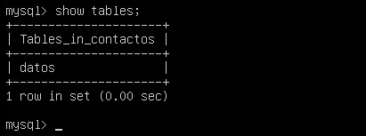
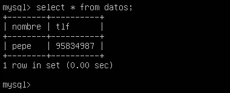
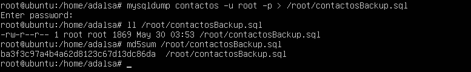
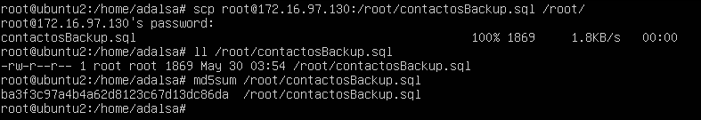
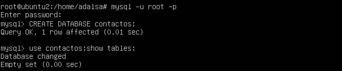
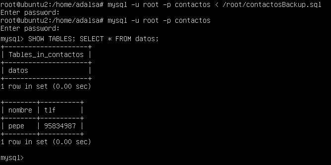

Práctica 5. Replicación de bases de datos MySQL
================================================

Objetivos
---------
En esta práctica se pretende aportar un grado más de fiabilidad a nuestro sistema ante posibles interrupciones de servicio permanentes del servidor maestro, para ello dispondremos de un servidor de backup con MySQL actuando como esclavo de replicación, de esta forma aumentaremos la fiabilidad del sistema sin que se vea afectado el rendimiento del sistema en producción y sin consumir demasiado ancho de banda.

Los objetivos concretos de esta práctica son:  
* Copiar archivos de copia de seguridad mediante ssh.  
* Clonar manualmente BD entre máquinas.  
* Configurar la estructura maestro-esclavo entre dos máquinas para realizar el clonad automático de la información.

Entorno
-------

Se ha utilizado el monitor de máquina virtual VMware Workstation 11 para crear las máquinas utilizadas para la práctica:

**Backend1 - Servidor LAMP**  
Hostname: ubuntu1  
OS: Ubuntu 12.04.5  
IP: 172.16.97.130  

**Backend2 - Servidor LAMP**  
Hostname: ubuntu2  
OS: Ubuntu 12.04.5  
IP: 172.16.97.129  

Crear un tar con ficheros locales y copiarlos en un equipo remoto
-----------------------------------------------------------------
En un primer acercamiento a la solución se podría crear una copia mediante la herramienta tar y transmitirla al servidor de backup mediante ssh.

    tar czf - firectorio | ssh esquipodestino 'cat > ~\tar.tgz'

Como se vio en la práctica 2 esta solución puede parecer útil para una copia de seguridad puntual, pero no es la solución optima para sincronizar grandes cantidades de información de forma de forma periódica.

Crear una BD e insertar datos
-----------------------------
En primer lugar, para probar la solución debemos crear una base de datos en MySQL en el servidor de producción, insertaremos algunos datos, para ellos usaremos la interfaz de línea de comandos de MySQL.

Para entrar a la linea de comandos de MySQL como root ejecutamos el siguiente comando:

    mysql -uroot -p

Una vez dentro de la linea de comandos creamos una base de datos llamada **contactos**.

    create database contactos;

Indicamos que trabajaremos sobre esa base de datos.

    use contactos;

Creamos una tabla llamada **datos**.

    create table datos(nombre varchar(100), tlf int);

Comprobamos que la tabla se ha creado correctamente.

    show tables;

Insertamos una tupla.

    insert into datos(nombre,tlf) values ("pepe", 95834987);

Comprobamos que la insercción se realizao correctamente.

    select * from datos;

Una vez creada la tabla e insertados datos ya podemos proceder a realizar la replica de la BD.

Replicar una BD MySQL con mysqldump
-----------------------------------
MySQL ofrece una herramienta llamada **mysqldump** que permite clonar las BD. Esta herramienta puede utilizarse para volcar BBDD para realizar copias de seguridad o para transferir datos a otros servidores SQL. El volcado normalmente cotiene sentencias SQL para crear las tablas y rellenarlas.

Un ejemplo de uso sería:

    # mysqldump ejemplodb -u root -p > /root/ejemplodb.sql

Dado que los datos pueden estar actualizandose constantemente en el servidor de BD principal, antes de realizar el volcado en el archivo **.sql** debemos evitar el acceso a la BD para modificaciones. Para ello en la máquina principal ejecutamos el siguiente comando dentro de la linea de comandos de MySQL:

    FLUSH TABLES WITH READ LOCK;

Este comando fuerza el cierre de todas las tablas abiertas, vuelca la caché de consultas y bloquea todas las tablas para todas las bases de datos con un bloqueo de lectura global.

Una vez realizado el bloqueo procedemos a realizar el volcado con **mysqldump**, en el servidor principal ejecutamos:

    mysqldump contactos -u root -p > /root/contactosBackup.sql

Finalizada la copia debemos quitar el bloqueo realizado anteriormente sobre las tablas. En la linea de comandos de mysql ejecutamos:

    UNLOCK TABLES;

Ahora desde la máquina esclava copiaremos el archivo .SQL con todos los datos guardados de la máquina principal.

    scp root@172.16.97.130:/root/contactosBackup.sql /root/

El fichero .SQL incluye todas las sentencias SQL necesarias para replicar las tablas y datos contenidos, pero no incluye la sentencia para crear la BD, por tanto la primera vez debemos crear a mano la BD en la máquina esclava.

Para restaurar los datos ejecutamos:

    mysql -u root -p contactos < /root/contactosBackup.sql

Se podría haber realizado el volcado y exportación a la máquina esclava en un solo comando, redireccionando la salida de mysqldump con un pipe a una conexión ssh.

    mysqldump contactos -u root -p | ssh equipodestino mysql

Replicación de BD mediante una configuración maestro-esclavo
------------------------------------------------------------  
