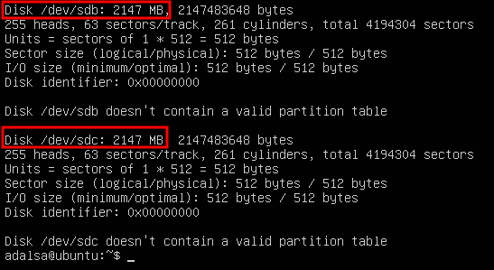
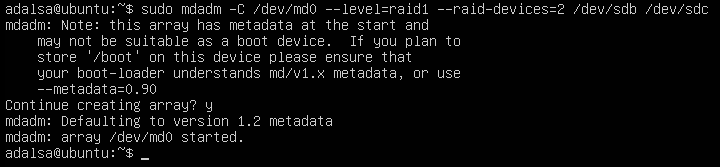
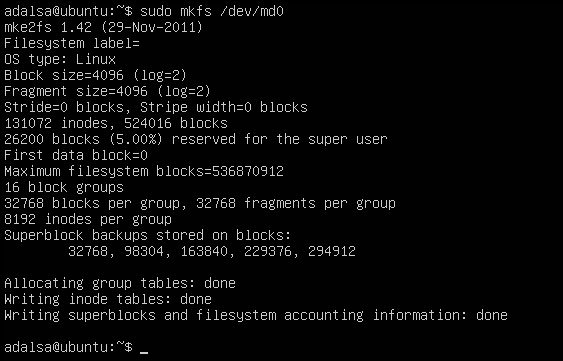
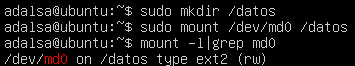
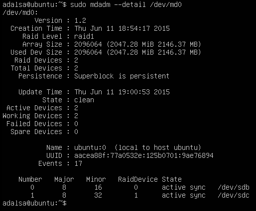
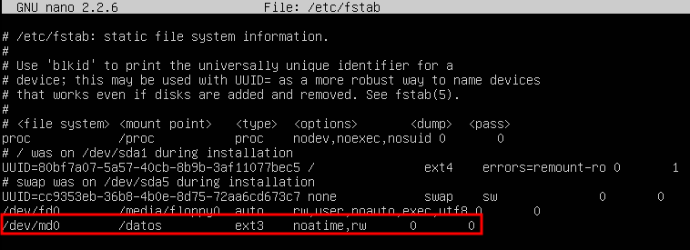
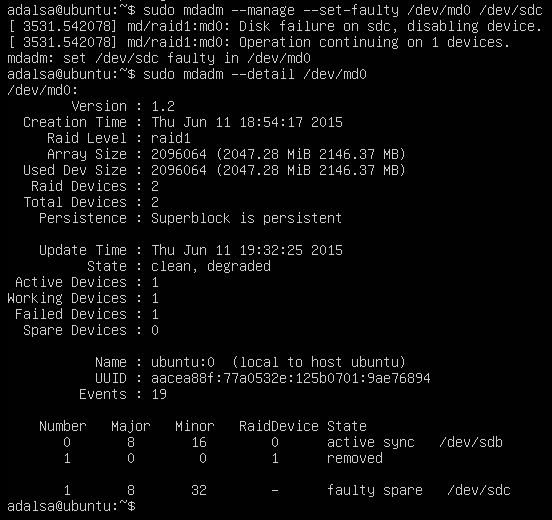
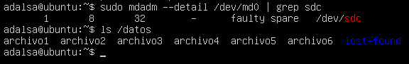
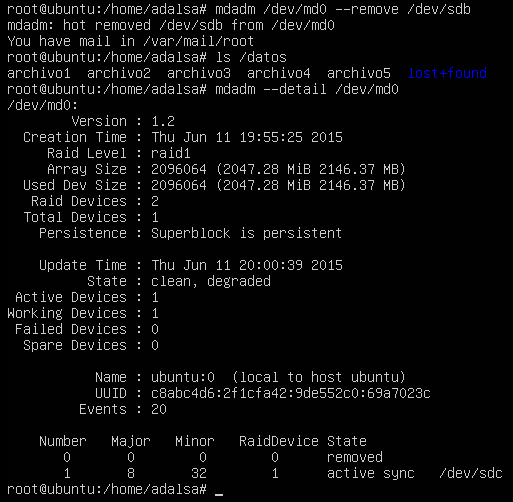

Práctica 6. Discos en RAID
==========================

Índice
------
* [Objetivos](#objetivos)
* [Entorno](#entorno)
* [Configuración del RAID por software](#configuracion-del-RAID-por-software)
* [Simulación de fallo](#simulacion-de-fallo)

-------------------------------------------------------------------------------

Objetivos
---------
En esta práctica configuraremos dos discos en RAID 1 por software, usando una maquina virtual con Ubuntu 12.04 server. Esta configuración RAID ofrece una gran seguridad al replicar los datos en los dos discos. Una vez configurado se probará a retirar y añadir discos para comprobar que el RAID sigue funcionando correctamente.

Entorno
-------

Se ha utilizado el monitor de máquina virtual VMware Workstation 11 para crear la máquina utilizadas para la práctica:

**Backend1 - Servidor LAMP**  
Hostname: ubuntu1
OS: Ubuntu 12.04.5
IP: 172.16.97.130

Configuración del RAID por software
-----------------------------------
Partimos de una máquina virtual ya instalada y configurada a la que hemos añadido dos discos del mismo tipo y capacidad.

En primer lugar instalamos la herramienta **mdadm** que nos permite crear, administrar y monitorizar uns sistemas software RAID, para ello usamos el sistema gestor de paquetes **apt**:

    # apt-get install mdadm

Debemos buscar información sobre ambos discos duros con el comando **fdisk**.

Una vez conocemos los identificadores de los discos duros ya podemos crear el RAID 1  con la opción **--level=y
raid1** usando el dispositivo /dev/md0, utilizando dos dispositivos con la opción **--raid-devices=2**.

    # mdadm -C /dev/md0 --level=raid1 --raid-devices=2 /dev/sdb /dev/sdc

Una vez creado el dispositivo RAID, le damos formato:

    # mkfs /dev/md0

Ahora ya podemos crear el directorio en el que se montará la unidad del RAID:

    # mkdir /datos
    # mount /dev/md0 /datos

Para comprobar el estado del RAID ejecutamos:

    # mdadm --detail /dev/md0

Por último configuraremos el sistema para que monte automáticamente el dispositivo RAID creado al arrancar el sistema. Para ello hay que editar el archivo **/etc/fstab**.

Simulación de fallo
-------------------

Para simular el fallo de un disco del sistema RAID utilizamos la opción **--set-faulty** proporcionada por mdadm.

Comprobamos que se puede seguir accediendo a la información correctamente.

Para simular la eliminación en caliente utilizamos la opción **remove** de mdadm.

Como se puede observar en la imagen anterior se puede seguir accediendo a los datos sin ningun problema.

Por último volveremos a agregar el disco duro eliminado con la opción **add**.

 
>Adrián Álvarez Sáez
